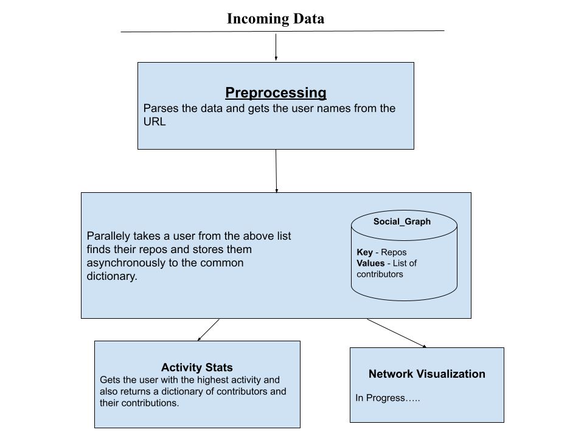

# social_hub
Makes social graph out of given list of GitHub Users

## 🚩 ABSTRACT
Discovers the social graph of people in a college from their github activity.

## ⚒️ How it Works



At present it takes the data, containing all the GitHub user's account URL, processess it and then generates a social graph for all their repo as well as repositories where they have shared contributions to.

After the preprocessing step, the program parallely looks for all the repos of all the users, gets them and stores them in a common dictionary, where key are the the repositories and values are list of contributors.

## 💻 Installation

`!!! Having a running Python:3.8 or > is a must. !!!` <br>

### Initializing

```console
$ git clone https://github.com/Neelaksh-Singh/social_hub.git
$ cd social_hub/
```
Go to the `sg_generator.py` file and update your file name [here](https://github.com/Neelaksh-Singh/social_hub/blob/c4ae604ad884446d4f3c6d3f9efada4dbb0344de/sg_generator.py#L22).

#### Setup your Virtual environment
```
python -m venv <venv_name>
source <venv_name>/bin/activate
pip install -r requirements.txt 
python sg_generator.py
```
#### Environment Variables

Create a `.env` file to insert your GitHub access token. You can refer to the `.env.example` format for more information.
